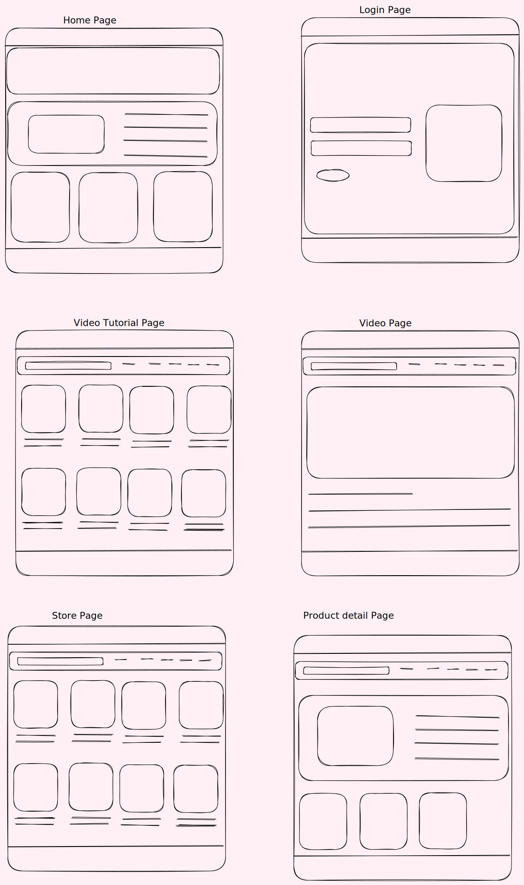

## Zhee-Gym-Hub-Nextjs

## ---- ONE PAGER  

 Read More 

### What is Zheé- Gym-Hub?

Zheé Hub is a one-stop hub for persons who want to live healthily. This e-commerce website will have a page with tutorials where people can work out based on their goals/target area, A store for persons who want to purchase clothing/apparel. Customers can sign into their accounts to see their progress, account details, and order history. A stretch goal is to add a blog where people can share tips and recommendations for others to learn from and a recommended diet page.

### Why Zheé- Gym-Hub? 
During covid, many people developed unhealthy eating and exercise habits, resulting in many people becoming weighed. Post covid, some people went on different healthy journeys to lose that weight and stay fit. While people embark on this healthy journey, Zheé- Gym-Hub will provide all their needs, workout, diet, and more to encourage others to start getting healthy.

### Measuring Sucess
To measure the website's success, we will allow users to share their feedback on the website. We will also measure what products/features customers enjoy. The MVP contains the tutorials, store, shopping cart, and account. We will include our stretch goals based on the timeframe and how well users want the website.

### Who is the Target Audience? 
The target audience are persons who are interested in working out and eating health, or persons who just want to maintain and healthy life style.This include all genders, ranginging from age 12 upwards.

## Feature Dump  

 Read More 

- Feature : User Account
    - User Story: As a teenage I was to be able to add items to my cart and comeback in a few weeks when I have acquired to money.

- Feature : Password authentication
    - User Story: As someone previously hack I want to ensure that my information is safely secured.

- Feature : Payment Options integrated
    - User Story: As a mom, I avoid having my cards with me so I dont lose them, i would like to have the option pay for products in my account and to be able to store payment.

- Feature : Blog (file sharing)
    - User Story: As someone who is new to working out I want to be able to learn from other persons. 

- Feature : Video player
    - User Story: As a busy studentI would like to have watch pre-categored workout videos specific to my goals recorded by proffessionals. I would like to have a Ads freevidoe watching experience.

- Feature : Video Recommendation
    - User Story: As someone who is new to working out i would like to see recommended videos based on my target goals given to me after i have complete one.

- Feature : Video Download
    - User Story: I would like to be able to watch videos from my device in cases where I am not able to access the website. 

- Feature : Mobile Phone Implementation
    - User Story: I would like to also get access to my account via my phne for times when I am on the go.

- Feature : clothing Recommendations
    - User Story:

- Feature : Clothing Review Option
    - User Story:
    
- Feature : Clothing Review Option
    - User Story:

- Feature : Diet Recommendation

- Feature : Chat Bot (Chat GPT)
    - User Story:

- Feature : Search bar 

- Feature : Filter Products

#### Deploy on Vercel

The easiest way to deploy your Next.js app is to use the [Vercel Platform](https://vercel.com/new?utm_medium=default-template&filter=next.js&utm_source=create-next-app&utm_campaign=create-next-app-readme) from the creators of Next.js.

Check out our [Next.js deployment documentation](https://nextjs.org/docs/deployment) for more details.

